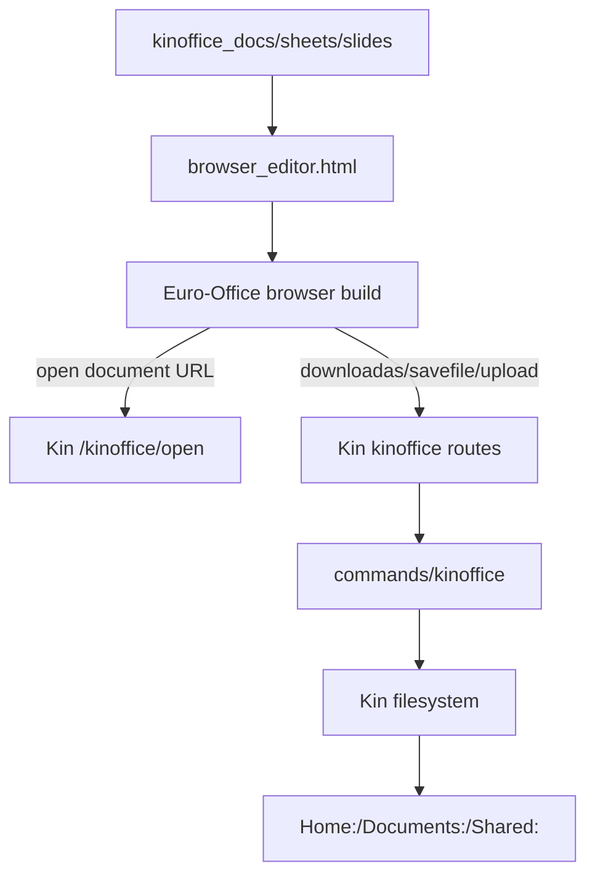

# Kin-Backed Document Service Plan

## Direction

Stop building or configuring Euro-Office as a native desktop app. Kin should provide the small server surface Euro-Office expects: document bytes, conversion/download responses, save callbacks, and image/upload helpers where needed. `kinoffice.cmd` becomes the document-service worker, while Kin HTTP/polykernel provides authenticated routing and filesystem access.

Relevant current state:

- [`scripts/build-euro-office-sdk-bundles.sh`](scripts/build-euro-office-sdk-bundles.sh) explicitly runs `npx grunt --desktop=true --no-color`.
- [`commands/kinoffice.cmd/main.c`](commands/kinoffice.cmd/main.c) currently supports only `action=template`.
- [`repository/Applications/Office/kinoffice_common/editor_bridge.js`](repository/Applications/Office/kinoffice_common/editor_bridge.js) still uses `_offline_`, direct byte injection, `type: 'desktop'`, and browser-side save/export hooks.
- Euro-Office’s normal server calls are visible in `sdkjs/common/editorscommon.js`: `../../../../downloadas`, `../../../../upload`, and `../../../../savefile`.

## Target Architecture

## Implementation Steps

1. Build Euro-Office as browser runtime, not native desktop.

- Change [`scripts/build-euro-office-sdk-bundles.sh`](scripts/build-euro-office-sdk-bundles.sh) to remove `--desktop=true` and update the status text.
- Remove native-desktop patches that only exist to fight `AscDesktopEditor`, `window.native`, `execCommand`, or `IS_NATIVE_EDITOR` behavior.
- Keep the source-loader replacement only if the normal browser build still needs stable bundled `sdk-all-min.js` paths.

2. Replace direct iframe byte injection with a Kin document session.

- In [`office_app.js`](repository/Applications/Office/kinoffice_common/office_app.js), create a per-open document session containing:
  - Kin path, file type, document key/id, title, user id.
  - Blank template bytes for new files via `kinoffice action=template`.
- In [`editor_bridge.js`](repository/Applications/Office/kinoffice_common/editor_bridge.js), configure DocsAPI with a real Kin URL instead of `_offline_`, for example `/kinoffice/open/{docId}` or an equivalent authenticated route.
- Use normal `openDocument` flow first; do not call native desktop open APIs.

3. Add authenticated Kin Office document routes.

- Add Kin HTTP/polykernel routing for Euro-Office-compatible paths, likely under `/kinoffice/...`, and optionally map the relative Euro-Office endpoints:
  - `GET /kinoffice/open/{docId}` returns current Office bytes from Kin FS or template session bytes.
  - `POST /kinoffice/downloadas/{docId}?cmd=...` handles Euro-Office conversion/save requests.
  - `POST /kinoffice/savefile/{docId}?cmd=...` writes final bytes back to the chosen Kin path.
  - `POST /kinoffice/upload/{docId}` handles inserted images/media if required.
- Keep routing authenticated by the existing Kin session. Do not accept client-supplied usernames as authority.

4. Extend `kinoffice.cmd` into a document-service command.

- Keep `action=template`.
- Add service actions with bounded timeouts and staged files rather than huge argv/base64 payloads:
  - `action=open session=...`
  - `action=downloadas session=... input=/tmp/... cmd=/tmp/... output=/tmp/...`
  - `action=savefile session=... input=/tmp/... path=Home:...`
- Use temp/staged files for binary payloads because generic `/api/commands/<command>` has 4 KiB arg buffers and a 10 second timeout today.
- If Euro-Office source provides a converter artifact later, wire it here. If not, initially rely on OOXML passthrough for docx/xlsx/pptx and only implement conversion formats once a converter exists.

5. Preserve Kin filesystem integration.

- Reads still originate from `GET /file/{volume}/...` or the Kin command reading from the resolved Kin path.
- Writes still use Kin’s existing safe file-write path (`write_binary` or chunked upload), but owned by the Kin service route/command rather than by the editor iframe.
- `Save As` should pass the chosen Kin path into the document session before save.

6. Verification

- Rebuild fresh packages from source.
- Deploy with `./deploy.sh --to-kin`.
- Test Docs first: blank open, edit, Save As, reopen saved file, edit, Save.
- Repeat for Sheets and Slides.
- Confirm the console has no `AscDesktopEditor`, `window.native`, `execCommand`, `/ds/`, `/direct/`, or Document Server requests.

où
## Risk Notes

- A normal browser build may still require `Asc.Addons.ooxml = true` or an equivalent addon packaging step for in-browser OOXML open/save. That should be handled as browser feature wiring, not as desktop/native mode.
- Full Document Server replacement may need more than open/save: images, mail merge, external data links, history, and conversion formats. For the first milestone, keep scope to DOCX/XLSX/PPTX open and save through Kin FS.