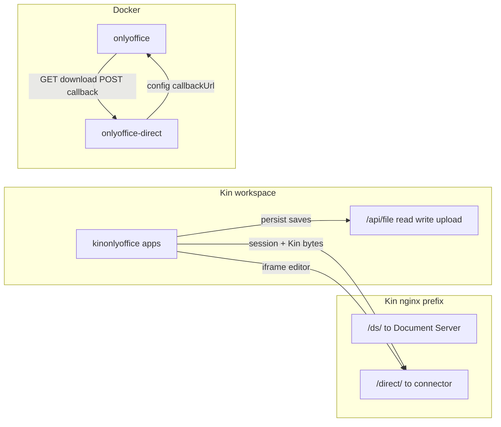

# kin-office architecture (OnlyOffice Direct)

## Why the direct connector exists

OnlyOffice Document Server requires:

1. A **download URL** for the document bytes when editing starts.
2. A **callback URL** when the user saves or autosaves (server-to-server).

Kin file APIs are **browser-session** scoped (`/api/file/read`, `/api/file/write`). The connector holds edit-session bytes in memory and implements the DS protocol; Kin apps copy saved content back to `Home:path.docx` (and optional `.info` sidecar for session rejoin).

## Callback URLs

| Variable | Typical value | Consumer |
|----------|---------------|----------|
| `DIRECT_DOCUMENT_BASE_URL` | `http://onlyoffice-direct:8000/direct` | Document Server inside Docker |
| `DOCUMENT_SERVER_INTERNAL_URL` | `http://onlyoffice/` | Connector fetching saved file from DS |
| `DOCUMENT_SERVER_PUBLIC_URL` | `/kin-office/ds/` | Browser-loaded DS API script |

Public editor URLs use Kin nginx `X-Forwarded-*` headers when `DIRECT_PUBLIC_BASE_URL` is unset.

## Kin app save flow

1. Open: read Kin file → `POST /direct/api/session` with `data_base64`.
2. Edit: iframe `/direct/editor?session=…`.
3. Autosave: DS → connector callback → version bump → app polls/events → `writeKinFileBytesSafe` to Kin path.

See [wbs/01-onlyoffice-direct-kinfs.md](wbs/01-onlyoffice-direct-kinfs.md) for acceptance tests.
