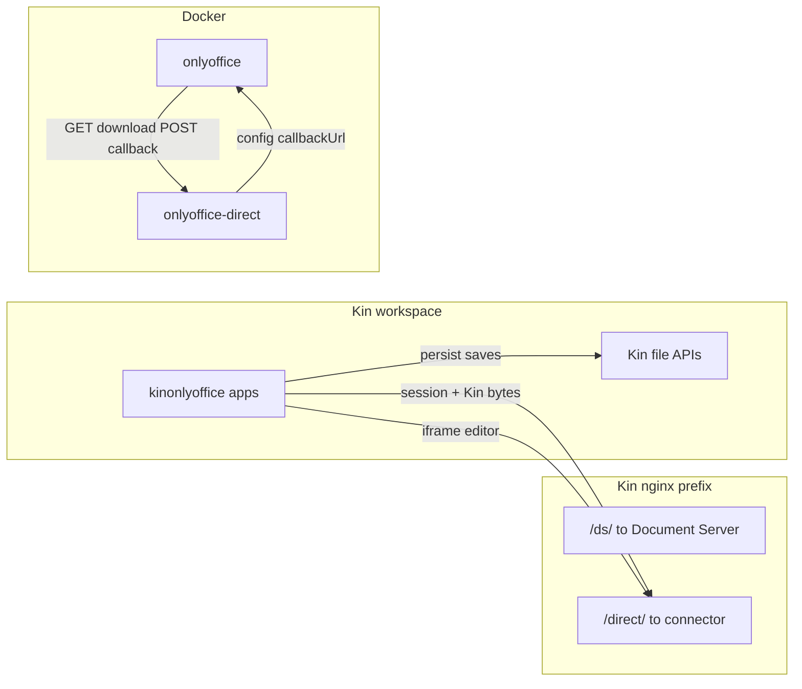
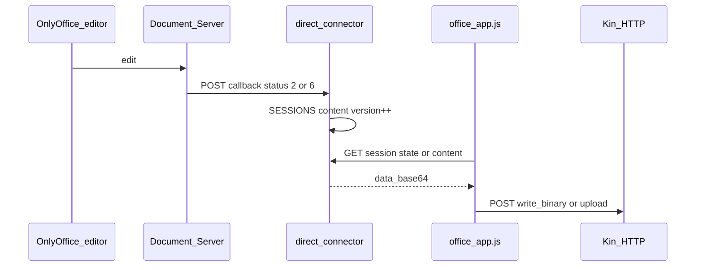

# kin-office architecture (OnlyOffice Direct)

## Why the direct connector exists

OnlyOffice Document Server requires:

1. A **download URL** for the document bytes when editing starts.
2. A **callback URL** when the user saves or autosaves (server-to-server).

Kin file APIs are **browser-session** scoped. The connector holds edit-session bytes in memory and implements the DS protocol; Kin apps copy saved content back to the Kin path (and optional `.info` sidecar for session rejoin).

The editor showing **saved** only means the Document Server finished a save cycle. Bytes land on `Home:…` only after hop 2 below succeeds.

## Callback URLs

| Variable | Typical value | Consumer |
|----------|---------------|----------|
| `DIRECT_DOCUMENT_BASE_URL` | `http://onlyoffice-direct:8000/direct` | Document Server inside Docker |
| `DOCUMENT_SERVER_INTERNAL_URL` | `http://onlyoffice/` | Connector fetching saved file from DS |
| `DOCUMENT_SERVER_PUBLIC_URL` | `/kin-office/ds/` | Browser-loaded DS API script |

Public editor URLs use Kin nginx `X-Forwarded-*` headers when `DIRECT_PUBLIC_BASE_URL` is unset.

## Kin file I/O (browser → Kin HTTP)

Implemented in `kinonlyoffice_common/office_app.js`.

| Operation | API | Notes |
|-----------|-----|--------|
| Open (read bytes) | `GET /file/{volume}/…` | Cache-busted query param; not `/api/file/read` for binary |
| Save (small/medium) | `POST /api/file/write_binary` | JSON `{ path, data_base64 }` — direct write to target path |
| Save (large, ≥ 16 KiB) | `upload_begin` → `upload_chunk` → `upload_finish` | Raw octet-stream chunks |
| Sidecar metadata | `POST /api/file/write` | Text JSON in `Home:file.docx.info` (`kinOnlyOffice.sessionId`) |

After write, the app readbacks the same path and checks length + OOXML ZIP header guards (`validateOfficeBytes`).

## Save pipeline (two hops)

1. **Open:** `readKinFileBytes` → `POST /kin-office/direct/api/session` with `data_base64`, `reloadFromDisk: true`.
2. **Edit:** iframe `/kin-office/direct/editor?session=…`.
3. **Persist:** On `documentStateChange` (saved), polling, or File → Save:
   - `ensureDirectSessionFlushed()` (force-save if needed; wait for connector `version` bump)
   - `fetchDirectContent()` → `GET …/session/{id}/content`
   - `writeKinFileBytesSafe(path, bytes)` → `write_binary` or chunked upload

Autosave polling: **500 ms** while `savePending`, **4 s** idle.

## Troubleshooting “saved but file unchanged”

1. Connector never got callback — check `journalctl -u kin-office | grep direct-connector` and DS → `onlyoffice-direct:8000` reachability.
2. No Kin path — new document without Save As has no `currentKinPath`; nothing is written to `Home:`.
3. Connector `version` did not advance — Kin sync is skipped; use File → Save and watch for “Save failed” dialog.

See [wbs/01-onlyoffice-direct-kinfs.md](wbs/01-onlyoffice-direct-kinfs.md) for acceptance tests.
