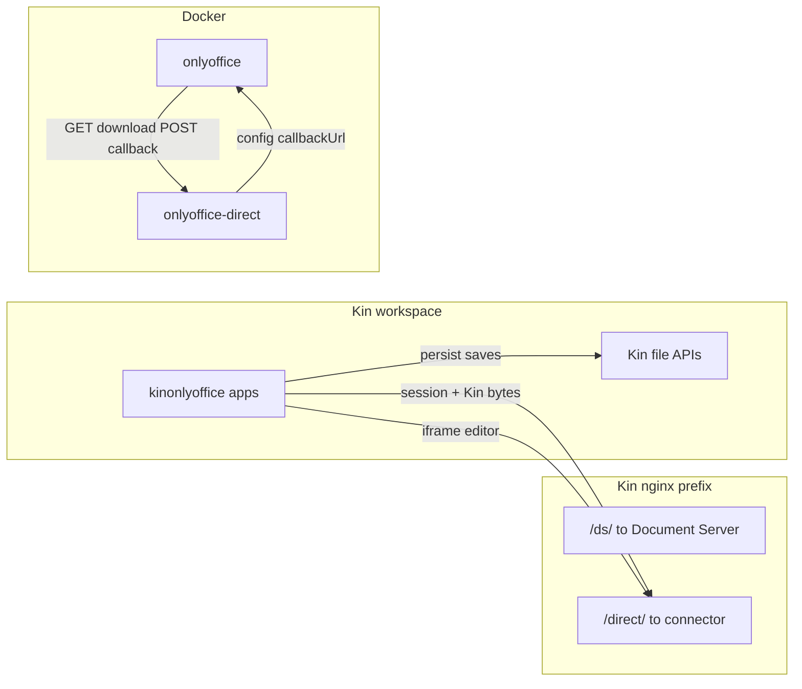
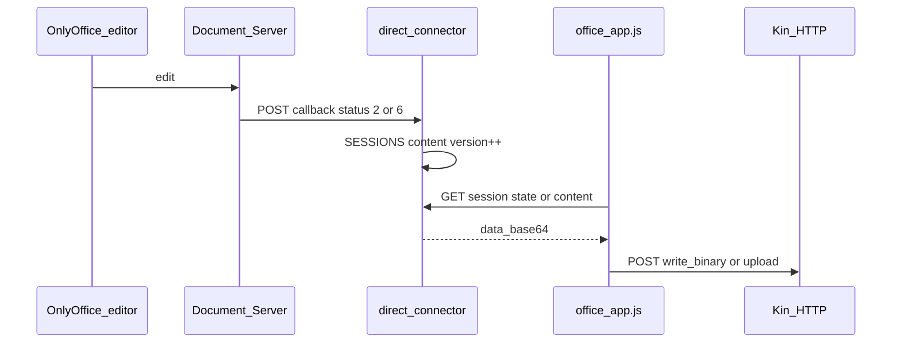

# kin-office architecture (OnlyOffice Direct)

## Why the direct connector exists

OnlyOffice Document Server requires:

1. A **download URL** for the document bytes when editing starts.
2. A **callback URL** when the user saves or autosaves (server-to-server).

Kin file APIs are **browser-session** scoped. The connector holds edit-session bytes in memory and implements the DS protocol; Kin apps copy saved content back to the Kin path (and optional `.info` sidecar for session rejoin).

The editor showing **saved** only means the Document Server finished a save cycle. Bytes land on `Home:…` only after hop 2 below succeeds.

## Callback URLs

| Variable | Typical value | Consumer |
|----------|---------------|----------|
| `DIRECT_DOCUMENT_BASE_URL` | `http://onlyoffice-direct:8000/direct` | Document Server inside Docker |
| `DOCUMENT_SERVER_INTERNAL_URL` | `http://onlyoffice/` | Connector fetching saved file from DS |
| `DOCUMENT_SERVER_PUBLIC_URL` | `/kin-office/ds/` | Browser-loaded DS API script |

Public editor URLs use Kin nginx `X-Forwarded-*` headers when `DIRECT_PUBLIC_BASE_URL` is unset.

## Kin file I/O (browser → Kin HTTP)

Implemented in `kinonlyoffice_common/office_app.js`.

| Operation | API | Notes |
|-----------|-----|--------|
| Open (read bytes) | `GET /file/{volume}/…` | Cache-busted query param; not `/api/file/read` for binary |
| Save (small/medium) | `POST /api/file/write_binary` | JSON `{ path, data_base64 }` — direct write to target path |
| Save (large, ≥ 16 KiB) | `upload_begin` → `upload_chunk` → `upload_finish` | Raw octet-stream chunks |
| Sidecar metadata | `POST /api/file/write` | Text JSON in `Home:file.docx.info` (`kinOnlyOffice.sessionId`) |

After write, the app readbacks the same path and checks length + OOXML ZIP header guards (`validateOfficeBytes`).

## Save pipeline (two hops)

1. **Open:** `readKinFileBytes` → `POST /kin-office/direct/api/session` with `data_base64`, `reloadFromDisk: true`.
2. **Edit:** iframe `/kin-office/direct/editor?session=…`.
3. **Persist:** On `documentStateChange` (saved), polling, or File → Save:
   - `ensureDirectSessionFlushed()` (force-save if needed; wait for connector `version` bump)
   - `fetchDirectContent()` → `GET …/session/{id}/content`
   - `writeKinFileBytesSafe(path, bytes)` → `write_binary` or chunked upload

Autosave polling: **500 ms** while `savePending`, **4 s** idle.

## Server-side autosave loop

DS only fires its callback on close (status 2) or when forcesave is triggered (status 6). It does **not** call back on internal "All changes saved" — that indicator reflects DS's own OT model, not the storage. To convert DS to real autosave-to-storage, the connector runs a background thread that POSTs `forcesave` to `CommandService.ashx` for every active session at a regular interval. DS responds with `error: 0` when there are real edits (status 6 callback follows with bytes) and `error: 4` when nothing changed (cheap no-op).

| Env | Default | Purpose |
|-----|---------|---------|
| `DIRECT_AUTOSAVE_INTERVAL_SECONDS` | `7` | Period of the connector autosave thread |
| `DIRECT_AUTOSAVE_IDLE_GRACE_SECONDS` | `60` | Skip sessions whose `last_seen` is older than this |
| `DIRECT_CALLBACK_DOWNLOAD_RETRIES` | `3` | Callback URL download attempts before giving up |

Status callback download is retried with a 500 ms backoff to ride out the few-hundred-ms window where DS sometimes returns 502 while finalizing.

## Honest sync indicator (client)

`office_app.js` tracks `kinSyncState ∈ { saved, dirty, saving, error }`. It drives:

- **Window title suffix** via `kin.classes.Window.setTitle` — ` — Saving to Kin…` while a write is in flight, ` — Unsaved`, ` — Save failed`. When the close gate is engaged the suffix becomes ` — <closeBlockReason>` (e.g. `Autosaving to Kin…`, `Unsaved — choose a location to save`) so the user always knows why close is held.
- **Footer pill** (top-right of the app shell, above the iframe) showing the same state with a coloured tone — green for saved, amber for in-flight, red for error.
- **Dim close overlay** — only shown when the user has actually pressed close and the gate is blocking it. Carries a spinner, the reason text, and a "Save now" button. After ~5 s without progress the copy upgrades to "Save is taking longer than expected — File → Save to retry or choose another location."

A "Saved" UX claim is only made after `writeKinFileBytesSafe` + readback succeeds. DS's own "All changes saved" toolbar text no longer drives any Kin-side promise.

## Troubleshooting "saved but file unchanged"

1. Connector autosave thread is silent — check `journalctl -u kin-office | grep "direct-connector: autosave"`. The loop should log `forcesave accepted` lines while a session is dirty. If they're missing, the connector container is unhealthy or DS CommandService is unreachable.
2. Callback download failing — look for `direct-connector: fetch_url attempt N/3 failed`. DS → `onlyoffice-direct:8000` reachability or DS save errors.
3. No Kin path — new document without Save As has no `currentKinPath`; the footer reads `Not saved to Kin — use File → Save As`. Pick a path.
4. Connector `version` did not advance — Kin sync is skipped; the footer reads `Unsaved — autosaving…` or `Save failed`. Use File → Save and watch the connector logs.

See [wbs/01-onlyoffice-direct-kinfs.md](wbs/01-onlyoffice-direct-kinfs.md) for acceptance tests.
