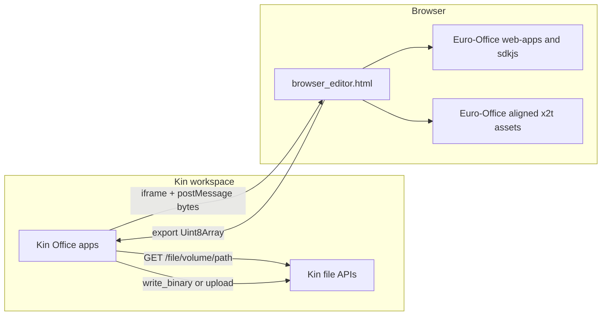
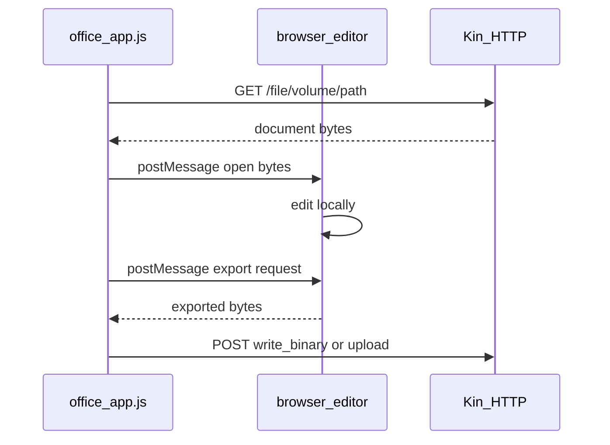

# Kin Office Architecture

## Why there is no connector

The old integration used a document server plus a Python connector because the official server flow expects a server-side editing service, download URL, and callback URL.

This branch removes that runtime. Kin apps now load a browser-local editor iframe and pass document bytes with `postMessage`. The iframe loads Euro-Office source-aligned browser assets and returns exported bytes to the Kin app, which writes them directly through Kin's existing browser-session file APIs.

## Asset provenance

- `scripts/fetch-euro-office-browser-sdk.sh` fetches pinned `Euro-Office/sdkjs`, `Euro-Office/web-apps`, and `Euro-Office/core` snapshots.
- Generated runtime assets live under `repository/Applications/Office/kinoffice_common/vendor/kin-office/packages/kin-office/`.
- `empty_bin.js` provides local blank document templates.
- `manifest.json` in the vendor directory records source repositories and commits.

## Kin file I/O

Implemented in `repository/Applications/Office/kinoffice_common/office_app.js`.

| Operation | API | Notes |
|-----------|-----|--------|
| Open (read bytes) | `GET /file/{volume}/…` | Cache-busted query param; not `/api/file/read` for binary |
| Save (small/medium) | `POST /api/file/write_binary` | JSON `{ path, data_base64 }` — direct write to target path |
| Save (large, ≥ 16 KiB) | `upload_begin` → `upload_chunk` → `upload_finish` | Raw octet-stream chunks |
| Sidecar metadata | `POST /api/file/write` | Text JSON in `Home:file.docx.info` |

After write, the app readbacks the same path and checks length + OOXML ZIP header guards (`validateOfficeBytes`).

## Save pipeline

1. **Open:** `readKinFileBytes` reads an existing Kin path, or `browser_editor.html` uses a local blank template for a new file.
2. **Edit:** `browser_editor_adapter.js` loads Kin Office assets and sends bytes into the editor with `asc_openDocument`.
3. **Persist:** On Ctrl+S, File → Save, Save As, or the editor save button, `office_app.js` requests export and writes the returned bytes with `writeKinFileBytesSafe`.

Autosave is disabled. Ctrl+S and explicit save actions remain the persistence boundary for Kin storage.

## Save policy

The editor state is not treated as a Kin save. Kin persistence is intentionally limited to explicit save requests that export editor bytes, write them through the Kin file API, and verify the readback length.

## Troubleshooting

1. Editor does not load — check that `vendor/kin-office/packages/kin-office/7/web-apps/apps/api/documents/api.js` exists.
2. New document fails — check that `vendor/kin-office/empty_bin.js` exists and defines `window.KinOfficeEmptyBin`.
3. Save fails — check browser console for export errors, Kin `write_binary` / upload errors, or readback mismatch.
4. No Kin path — new document without Save As has no `currentKinPath`; Save should prompt for a path.

See [wbs/01-kinoffice-kinfs.md](wbs/01-kinoffice-kinfs.md) for acceptance tests.
